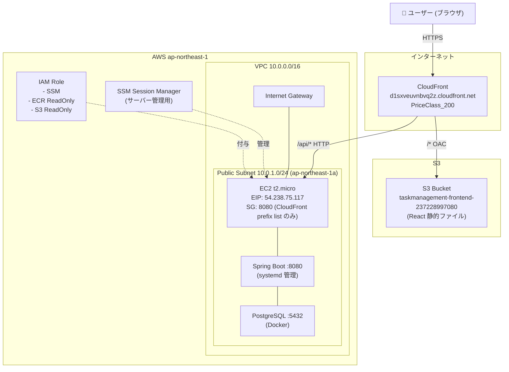

# NW 構成図

本プロジェクト（taskmanagement）の AWS ネットワーク構成を示す。

---

## 構成概要

```
インターネット
     │
     ▼
┌─────────────────────────────────────────────────┐
│  CloudFront (PriceClass_200)                    │
│  https://d1sxveuvnbvq2z.cloudfront.net          │
│                                                 │
│  /api/*  ──→  EC2:8080 (HTTP, カスタムオリジン)  │
│  /*      ──→  S3 (OAC, HTTPS)                   │
└───────────────┬─────────────────────────────────┘
                │
    ┌───────────┴───────────┐
    ▼                       ▼
┌──────────────┐   ┌────────────────────────────────────┐
│  S3 Bucket   │   │  VPC: 10.0.0.0/16                  │
│  (フロント   │   │  ap-northeast-1                     │
│  エンド配信) │   │                                    │
│              │   │  ┌──────────────────────────────┐  │
│  OAC のみ    │   │  │  Public Subnet: 10.0.1.0/24  │  │
│  アクセス許可│   │  │  ap-northeast-1a              │  │
└──────────────┘   │  │                              │  │
                   │  │  ┌────────────────────────┐  │  │
                   │  │  │  EC2 (t2.micro)        │  │  │
                   │  │  │  EIP: 54.238.75.117    │  │  │
                   │  │  │                        │  │  │
                   │  │  │  ┌──────────────────┐  │  │  │
                   │  │  │  │ Spring Boot :8080 │  │  │  │
                   │  │  │  └──────────────────┘  │  │  │
                   │  │  │  ┌──────────────────┐  │  │  │
                   │  │  │  │ PostgreSQL :5432  │  │  │  │
                   │  │  │  │  (Docker)        │  │  │  │
                   │  │  │  └──────────────────┘  │  │  │
                   │  │  └────────────────────────┘  │  │
                   │  │          ▲                   │  │
                   │  │          │ SSM Session Manager│  │
                   │  │          │ (SSH 不使用)       │  │
                   │  └──────────────────────────────┘  │
                   └────────────────────────────────────┘
```

---

## Mermaid 図



---

## リソース一覧

| リソース | 値 | 備考 |
|---|---|---|
| CloudFront URL | `https://d1sxveuvnbvq2z.cloudfront.net` | エンドユーザー向けエントリーポイント |
| CloudFront Distribution ID | `E1U5YS63SSQ5HH` | キャッシュ無効化時に使用 |
| S3 バケット | `taskmanagement-frontend-237228997080` | フロントエンド静的ファイル置き場 |
| EC2 Instance ID | `i-08295b40ac01f03cf` | SSM 接続時に使用 |
| EC2 EIP | `54.238.75.117` | CloudFront → EC2 のオリジン IP |
| VPC CIDR | `10.0.0.0/16` | ap-northeast-1 |
| Public Subnet | `10.0.1.0/24` | ap-northeast-1a |

---

## セキュリティグループ（EC2）

| 方向 | ポート | 送信元/宛先 | 用途 |
|---|---|---|---|
| Inbound | 8080 | CloudFront prefix list (`pl-58a04531`) | API リクエスト受信 |
| Outbound | All | `0.0.0.0/0` | 外部通信（S3・SSM・ECR 等） |

> SSH(22) は一切開放していない。サーバー管理は SSM Session Manager を使用。

---

## 通信フロー

### フロントエンドへのアクセス

```
ユーザー
  → HTTPS → CloudFront (/* ルール)
  → OAC 署名 → S3 (React HTML/JS/CSS)
  → CloudFront キャッシュ → ユーザー
```

### API リクエスト

```
ユーザー (ブラウザ)
  → HTTPS → CloudFront (/api/* ルール)
  → HTTP → EC2:8080 (Spring Boot)
  → PostgreSQL:5432 (同一インスタンス上の Docker)
  → レスポンス → ユーザー
```

### デプロイフロー

```
ローカル PC
  → mvn package → app.jar
  → aws s3 cp → S3 (backend/app.jar)
  → aws ssm send-command → EC2
      → aws s3 cp → /app/app.jar
      → systemctl restart taskmanagement

ローカル PC
  → npm run build → dist/
  → aws s3 sync → S3 (フロントエンド)
  → aws cloudfront create-invalidation → キャッシュクリア
```
