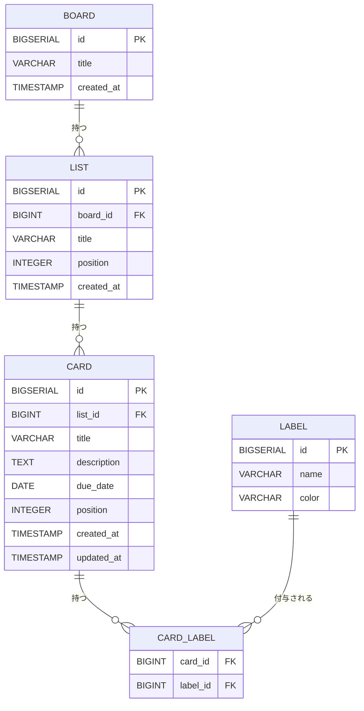

# 技術設計書：タスク管理アプリ

**バージョン：** 2.0  
**作成日：** 2026-04-25  
**更新日：** 2026-05-03  
**ステータス：** ドラフト

---

## 関連ドキュメント

| ドキュメント | 内容 |
|---|---|
| [要件定義書.md](要件定義書.md) | 目的・機能要件・画面仕様 |
| [開発計画書.md](開発計画書.md) | 開発フェーズ |

---

## 1. 技術スタック

| レイヤー | 技術 |
|---|---|
| フロントエンド | React + Vite + TypeScript + Tailwind CSS |
| バックエンド | Java 21 + Spring Boot 3 |
| ORM | Spring Data JPA（Hibernate） |
| ビルドツール | Maven |
| データベース | PostgreSQL |
| API形式 | REST API |

### 採用理由

| 技術 | 理由 |
|---|---|
| Java 21 | LTS（長期サポート）バージョン。安定性・情報量ともに豊富 |
| Spring Boot 3 | Java の Web API 開発における事実上の標準フレームワーク |
| Spring Data JPA | SQLを直接書かずにデータベース操作できるORM。Hibernate が実装 |
| Maven | XML ベースのビルドツール。Spring Boot の公式ドキュメントで多く使われており学習コストが低い |
| PostgreSQL | 本番利用にも耐えるオープンソースのリレーショナルDB。SQLite より拡張性が高い |
| Vite | React + TypeScript の高速ビルドツール。Next.js 不使用のためシンプルな構成を採用 |
| Tailwind CSS | ユーティリティファーストのCSSフレームワーク。クラス名だけでスタイルを当てられる |

---

## 2. データ構造

### 2-1. データ構造ツリー

```
ボード（Board）
 └─ id：識別番号
 └─ title：ボード名
 └─ リスト一覧（List）
      └─ id：識別番号
      └─ title：リスト名
      └─ position：並び順
      └─ カード一覧（Card）
           └─ id：識別番号
           └─ title：カードタイトル
           └─ description：説明文
           └─ due_date：期限日
           └─ position：並び順
           └─ ラベル一覧（Label）※多対多
                └─ id：識別番号
                └─ name：ラベル名
                └─ color：カラーコード
```

---

### 2-2. ER図



**リレーション説明**

| テーブル | 関係 | 説明 |
|---|---|---|
| BOARD → LIST | 1対多（1:N） | 1つのボードは複数のリストを持つ |
| LIST → CARD | 1対多（1:N） | 1つのリストは複数のカードを持つ |
| CARD ↔ LABEL | 多対多（M:N） | 中間テーブル CARD_LABEL で管理 |

---

## 3. API設計

### 3-1. 基本方針

- アーキテクチャ：REST API
- ベースURL：`http://localhost:8080/api`
- データ形式：JSON
- エラーレスポンス形式：`{ "status": 404, "message": "メッセージ" }`

---

### 3-2. エンドポイント一覧

#### ボード（Board）

| メソッド | エンドポイント | 概要 |
|---|---|---|
| GET | `/boards` | ボード一覧取得 |
| GET | `/boards/{id}` | ボード詳細取得（リスト・カード含む） |

---

#### リスト（List）

| メソッド | エンドポイント | 概要 |
|---|---|---|
| POST | `/boards/{boardId}/lists` | リスト追加 |
| PATCH | `/lists/{id}` | リスト名・並び順の更新 |
| DELETE | `/lists/{id}` | リスト削除（配下カードも削除） |

---

#### カード（Card）

| メソッド | エンドポイント | 概要 |
|---|---|---|
| POST | `/lists/{listId}/cards` | カード追加 |
| PATCH | `/cards/{id}` | カード内容の更新（タイトル・説明・期限日・並び順・移動先リスト） |
| DELETE | `/cards/{id}` | カード削除 |

---

#### ラベル（Label）

| メソッド | エンドポイント | 概要 |
|---|---|---|
| GET | `/labels` | ラベル一覧取得 |
| POST | `/cards/{cardId}/labels/{labelId}` | カードにラベルを付与 |
| DELETE | `/cards/{cardId}/labels/{labelId}` | カードからラベルを外す |

---

### 3-3. レスポンス例

#### カード追加

```json
POST /api/lists/1/cards
Request:  { "title": "デザインの修正" }

Response 201:
{
  "id": 5,
  "listId": 1,
  "title": "デザインの修正",
  "description": null,
  "dueDate": null,
  "position": 3,
  "createdAt": "2026-05-01T10:00:00Z",
  "updatedAt": "2026-05-01T10:00:00Z"
}
```

#### エラーレスポンス

```json
Response 404:
{
  "status": 404,
  "message": "List not found"
}
```
